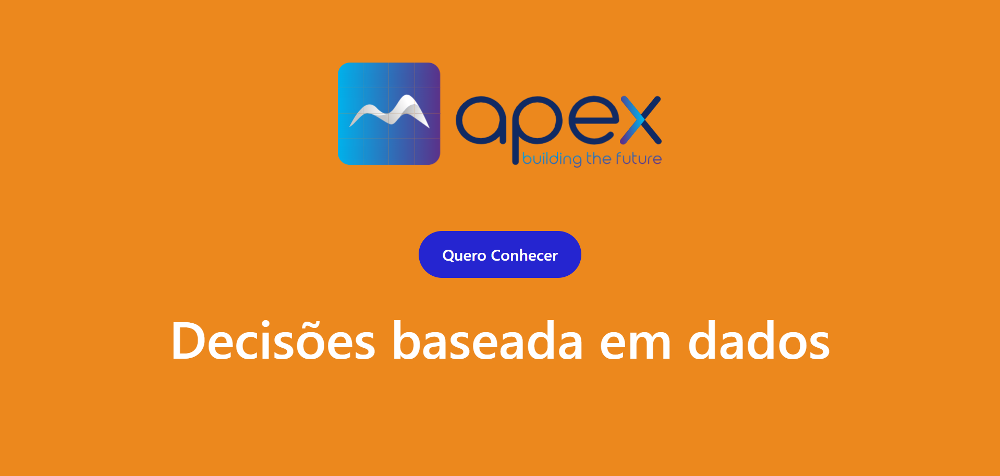
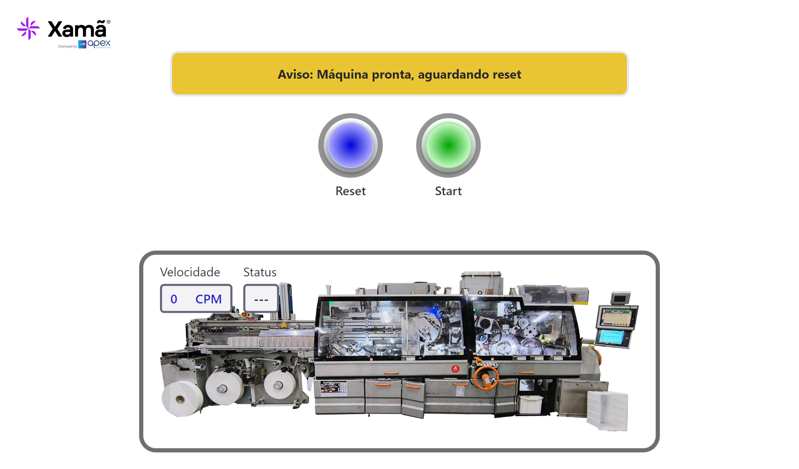

# 💡 Quiz Game

Um game online para o lançamento de uma aplicação de machine learning. No Game pode partir uma máquina industrial e tentar acertar algumas perguntas técnicas.

__Você pode ver esse projeto bem [Aqui](https://www.seuSite.com.br)__

 🖥️ Home Page                                                   |  🖥️ Game Page
:----------:                                                      |  :--------------:
 |  

## ⚙️ Funcionalidades

- ✅ Animações
- ☑️ Gamificação
- ✅ Perguntas randômicas
- ☑️ Design responsivo

## 🧩 Tecnologías Utilizadas

  
  
  
  
  
  

## ⌛ Status do projeto

- [X] Responsividade

## 🤯 Aprendizados

Manipulação da DOM, criação de funções randomicas usando javascript puro, design responsivo.

## 💬 Vamos nos conectar?

  
    
  
    
  
    
  
    
  

